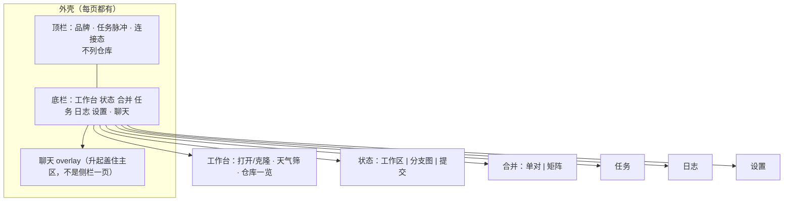

# 布局改造方案（整合稿 → 生产）

> **状态**：第 1–3、5–6 刀已上生产（外壳、工作台、状态、聊天升起、任务/日志/设置换皮）。**第 4 刀合并页尚未改。**  
> **日期**：2026-09-15  
> **示意**：`/#/ui-lab/deck`（mock，不改仓库）。对照四套仍在 `/#/ui-lab`。  
> **验收表**：[布局改造-功能对比.md](./布局改造-功能对比.md)  
> **已落地行为**仍以 [设计文档.md](./设计文档.md) 为准。本文只写「界面怎么换、分几刀做」，不改 Git / MCP / 开单闸。

一次性换完全部页面不现实。按阶段交付：每一刀上线后，现网功能必须还能用；没轮到的页可以暂时还是旧布局，但要能在新外壳里打开。

---

## 1. 要解决什么

现网观感：暗色侧栏 + 卡片堆叠，12px 挤、一板一眼、少呼吸。实验室四套里挑过方向，整合稿（Deck）拼法如下。

| 来源 | 采用 | 不采用 |
|------|------|--------|
| Aurora 指挥台 | 青紫玻璃、底栏居中、聊天从底下升起 | 顶栏列出全部仓库；bento 把下一张仓卡挤进「未同步」旁边 |
| Grove 园圃 | 天气筛仓（卡住=雷雨、更改=薄雾、未同步=刮风、干净=晴天） | 黄调 |
| Studio 剧场 | 工作区红绿监视器 diff | 黄调；合并页整页剧场化（流程仍走现网单对/矩阵） |
| Orbit | — | 命令面板不当主壳 |

硬约束（改造时不许破）：

- 不重写 core / MCP / 开单闸 / 选边规则。`into` = 线上 / ours，`from` = 我的 / theirs。
- 写操作仍走 dry-run 确认框。冲突选边只在网页。工作区 continue **不带 files**。
- 全局密度先跟现网令牌：`--gc-text` 12px、标题最多 14px、`--gc-pad` 12px、`--gc-gap` 8px、`--gc-control` 28px、`--gc-line` 32px、`--gc-radius` 6px。
- **顶栏不列仓库**。换仓只在工作台卡片（或英雄卡进状态/合并）。
- 实验室多出来的装饰可以留，但不能替代现网入口（打开、克隆、移除、批量 fetch 等）。

第一轮 **换壳保功能**：外壳和栅格改掉，内部继续用 Element Plus 与现有组件（`ConflictResolvePanel`、`CommitGraph`、`MrCreateDialog`、`CloneDialog` 等）。不要把按钮、表格、树选择全自绘。

---

## 2. 目标信息架构

路由保持 hash，路径不改：`/dashboard` `/status` `/merge` `/jobs` `/logs` `/settings`。聊天可以仍是 `/chat`，壳上用 overlay 包现有 `ChatView`，避免两套会话逻辑。

侧栏「当前仓库」路径盒去掉。当前仓只出现在：

- 工作台英雄卡（选中那一张）
- 状态 / 合并 / 聊天的页内上下文（名称或路径一行即可）
- MCP 未指定仓时仍用 `last_opened_at`（逻辑不变）

底栏「任务」显示进行中数量（现网侧栏角标挪过来）。

---

## 3. 各页目标形态

### 3.1 工作台

上：当前仓英雄卡（没有仓则空态：路径输入 + 打开 + 克隆）。  
中：天气数字条（与仓库网格分开，禁止再挤进同一格）。  
下：仓库一览卡片。点选当前仓；双击或「进入」去状态；「合并」去合并页。

天气与现网筛选对齐：

| 天气 | 现网芯片 | 判定（`attentionOf`） |
|------|----------|----------------------|
| 全部 | 全部 | — |
| 雷雨 | 卡住 | 不可用 / 工作区 merge·rebase / 有冲突 |
| 薄雾 | 有更改 | `dirtyCount > 0` |
| 刮风 | 未同步 | ahead+behind > 0 或有合并草稿 |
| 晴天 | （现网没有单独档） | 其余干净仓。可新增，不能取消前四档 |

卡片上现网已有字段都要还在：分支、↑↓、更改、冲突、operation、合并草稿、12 周热力、上次打开。点选当前仓；右上角 ⋯ 进入/合并/移除（菜单挂 body）。「刷新」对全部可用仓 `git fetch`，合成一条 Job。拖拽写 `pin_order`；移除不删磁盘。

打开本地仓、克隆弹层是**现网主路径**。实验室里这两处只是样子，接到生产必须接回 `openRepo` / `startClone`。

### 3.2 状态

三档仍是 **工作区 | 分支图 | 提交**（现网 0.1.17 信息架构）。

工作区目标布局（Studio 监视器）：

- 左：分支树（双击切换、右键菜单、新建）
- 中：更改树（未暂存 / 已暂存 / 未跟踪 / 全部）
- 右：红绿 diff
- 底或侧：记录（Stash / 备份 / reflog / Worktree）
- 工具条：提交、暂存、stash、fetch、工作区合并、打标签、高风险四件套……**一条不删**

分支图、提交面板继续用现有 `CommitGraph` / `CommitLogPanel`，只换外框。

卡住时：现网 `ConflictResolvePanel` 写回工作区 + 继续/中止。不要用实验室那种「点一下左右就算选边」。

### 3.3 合并

单对 / 矩阵合一，档位按钮与开单闸不变（见设计文档 0.1.20）。

视觉：干净预演可保留两条河示意；**冲突必须用现网三栏 hunk 选边**，不要实验室整页点边。矩阵格颜色用现网 `--gc-matrix-*`，不要黄。

### 3.4 聊天

从侧栏独立页改成底栏升起 overlay。会话、流式、确认条、按仓 `sessionId`、无 Key / 无仓 / 离线，全部沿用现网 `ChatView` 逻辑。第一期能力边界文案保留（看改动/暂存/提交；推送和合并走别的页）。

### 3.5 任务 / 日志 / 设置

信息结构不动（任务左右分栏 + `?id=`；日志过滤器；设置四 Tab + query）。外观跟整合稿：芯片 Tab、玻璃栈、任务左右玻璃板、日志自定义行表。Git 操作是整行工具列表，不要再塞进会互相挤压的 Element 卡片。

设置「正文规范」继续用 `MrTemplateSettings`，不要实验室三个只读框。

---

## 4. 明确不做（本方案）

- 不改 MCP 工具语义、不把 Token 塞进工具参数。
- 不把多条 from 合成一条批量临时枝。
- Agent 不在聊天里选边（冲突给网页）。
- 第一轮不自绘全套控件、不上命令面板当主导航。
- 不把布局实验室当生产；示意数据不能进验收通过标准。

---

## 5. 分期（每一刀可单独验收）

原则：**外壳先通，页面后换皮；换皮时对照功能表打勾，缺一项不算过。**  
工期按 1 名熟悉本仓库的人估算，含联调，不含把 Element 全换成自绘。

### 第 0 刀 — 文档冻结（本文）

产出：本方案 + 功能对比表。不改生产代码。  
完成标准：人和后续实现都拿这两份对，而不是拿 Deck mock。

### 第 1 刀 — 外壳（约 2–3 天）

只动 `App.vue` 与全局壳，**各业务页可以仍是现在的 Element 布局**。

- 去掉左侧栏；底栏导航（干活：工作台/状态/合并；系统：任务/日志/设置；聊天）。
- 顶栏：品牌 + 任务脉冲（真实 running 数）+ 连接态。**不列仓库。**
- 主区为现有 `router-view`，底部留出 dock 高度。
- 聊天：底栏点开 overlay，内嵌现有聊天页（或抽出同一套组件）。关 overlay 回到进入前的页。
- 有模型 Key 时聊天在底栏更靠前，与现网「Key 则置顶」同义。
- 实验室入口可先留在顶栏角落，避免丢示意。

完成标准：现网每一页从底栏能进、功能不回退；离线 tag 仍可见。  
**本刀即可上线。** 后面几刀可以间隔很久。

### 第 2 刀 — 工作台（约 2–3 天）

`ReposView` + `RepoCard` 换整合稿排版，**API 行为零折扣**。

必须接上（实验室现在缺失或没接线的）：

- 打开本地路径（空路径/失败/成功切当前仓并刷新 overview）
- 克隆弹层 → Job → 入一览
- 移除（确认、不删磁盘）
- 「刷新」对全部可用仓 fetch，合成一条 Job
- 拖拽 `pin_order`
- 丢失仓不可进状态/合并

完成标准：功能对比表「工作台」一节全勾。E2E 里工作台脏计数、筛选仍过。

### 第 3 刀 — 状态（约 4–6 天）

最重。工具条、树、diff、图、提交、记录、卡住选边全部留下，只改栅格和监视器外观。

工作区栅格：左分支树（约 220px）· 中更改树 · 右上差异监视器 + 右下记录。点文件看真 `DiffViewer`，不再开抽屉。图/提交仍收起左树、铺满。

**已落地。** 完成标准：功能对比表「状态」全勾；工作区 merge/rebase 卡住路径手测一遍。

### 第 4 刀 — 合并（约 3–5 天）

单对档位按钮、三栏选边、矩阵、回程条、MR 对话框换外壳。禁止简化成实验室「点左右就落盘」。

完成标准：干净一对走通预演→落盘→推送→看正文（dry_run）；冲突一对网页选边；矩阵跑格、建议顺序、过期重跑。

### 第 5 刀 — 聊天升起打磨（约 1–2 天）

第 1 刀若已 overlay，这里做动画、避让 dock、换仓清会话、确认条贴在输入框上方（实验室喜欢的交互，接到真确认闸）。

**已落地。** 完成标准：功能对比表「聊天」全勾。

### 第 6 刀 — 任务 / 日志 / 设置换皮（约 2–3 天）

**已落地。** 完成标准：对应三节全勾；规范导入/保存、Token 校验、危险工具开关仍走现网 store。信息结构未改（任务左右分栏 + `?id=`；日志按工具过滤；设置四 Tab + query）。设置「正文规范」仍用 `MrTemplateSettings`。

### 第 7 刀 — 收口（约 2–3 天）

- 边界：离线、无仓、无 Key、仓丢失，每页扫一遍。
- 实验室：生产达标后可下线入口，或仅内部门。
- 更新 [设计文档.md](./设计文档.md) 信息架构（侧栏改为底栏），并补 E2E（打开仓、底栏跳转）。

---

## 6. 累计工期

| 范围 | 工作日 |
|------|--------|
| 第 1–2 刀（壳 + 工作台） | 4–6 |
| 做到状态 | 8–12 |
| 做到合并 + 聊天 | 12–19 |
| 全部换皮 + 收口 | **16–25** |

若中途决定连控件都自绘，再加 8–12 天，不作为默认路径。

建议停顿点：第 1 刀后、第 2 刀后。工作台是用户每天第一眼，也是「打开 Git 项目」缺口所在，应早于状态/合并换皮。

---

## 7. 实现时注意

- 生产组件不要复制 `DemoDeck.vue` 的 mock 按钮。Deck 只供对照布局。
- `theme.css` 令牌继续当唯一密度来源。实验室已按令牌收过一版，生产直接用 `--gc-*`。
- 聊天 overlay 不要第二套 `streamChat`。
- 矩阵/单对会话仍用 `useMergeSessionStore`，不要因换页销毁 trail。
- 底栏 `z-index` 低于确认框、低于 MR 对话框、低于选边面板。

---

## 8. 和现有文档的关系

| 文档 | 关系 |
|------|------|
| [设计文档.md](./设计文档.md) | 功能事实与 MCP；本方案落地后改 § 信息架构（侧栏→底栏） |
| [布局改造-功能对比.md](./布局改造-功能对比.md) | 分期验收清单 |
| [聊天壳方案.md](./聊天壳方案.md) | 聊天能力与确认闸；本方案只改它出现的位置 |
| [待考虑.md](./待考虑.md) | 按仓模板等，不在本次布局改造范围 |
