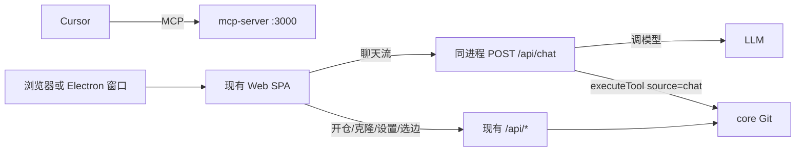

# Git Cockpit 聊天壳方案

> **版本**：0.3  
> **日期**：2026-09-14  
> **状态**：第一期主干已落地。已实现行为以 [设计文档.md](./设计文档.md) 为准；本文写目标形态与硬规则。第二期预演/落盘/开 MR 未做。  
> **对照**：已落地行为只以 [设计文档.md](./设计文档.md) 为准。  
> **修订记录**：
>
> - v0.1：可选 `apps/chat` 网页壳（`:3100`）+ Vercel AI SDK；不改三包身份。
> - v0.2：对照代码补可行性、风险、确认闸、Cockpit 加固。
> - v0.3：取消独立聊天网站。改为 **Electron 套现有 Vue** + daemon 内 `POST /api/chat`；模型配置进现有设置页（浏览器与桌面同一套，不做入口控制）；打开/克隆等入库与 Web 共用 SQLite；桌面包独立 GitHub Release。Tauri 不作为第一期选型。

实现须同步 [设计文档.md](./设计文档.md) §13 与根 README。未完成项不要写进「已实现范围」。

---

## 0. 一句话

Cockpit 仍是唯一 Git 后端。聊天是现有 Web 上的一页，对话循环跑在 **同一个** `git-cockpit start` 进程里（Vercel AI SDK 只出现在 mcp-server）。Electron 是可选宿主：双击打开窗口、拉起或复用 daemon，避免日常对着两个 cmd。配 Cursor MCP **不会**、也 **不必** 打开桌面聊天窗。

没有桌面、没有填模型 Key 时，产品和现在一样：脑子在 Cursor，手在 Cockpit。

---

## 1. 和现有产物、SDK、桌面的关系

|            | Git Cockpit（现有）                                   | Vercel AI SDK    | Electron               |
| ---------- | ----------------------------------------------------- | ---------------- | ---------------------- |
| 是什么     | Git 手 + 网页 + MCP +（方案中）对话接口               | 造对话循环的零件 | 窗壳 + 开机拉起 daemon |
| 会不会思考 | 判断来自所接模型；没配 Key 则不聊                     | 不思考，只接模型 | 不思考                 |
| 懂不懂 Git | 懂；权限 / 干跑 / 备份 / 审计                         | 不懂             | 不懂                   |
| 模型 Key   | 方案中写入 `config.json` 的 `llm`（与 MR Token 同级） | 调用时需要       | 不单独再存一份         |

三种用法并存，不是互斥：

- **形态 A（已有）**：人 ↔ Cursor ↔ `/mcp`。日常配 MCP 走这条，与聊天页无关。
- **形态 B（方案）**：人 ↔ 浏览器 `http://localhost:3000` 的聊天页 ↔ 同进程 `/api/chat`。要先 `git-cockpit start` 并在设置里填 Key。
- **形态 C（方案）**：人双击桌面应用 ↔ 内部仍是 B（同一套 Web + 同一 daemon）。

SDK 不会让 Cockpit 变聪明。Git 规矩仍以 MCP Prompt 为准（`safe_commit` / `merge_preview_apply` / `workspace_continue` / `open_mr`）。模型调 Git **禁止**再 spawn git，走现有 `executeTool`（`source: 'chat'`），与网页按钮同一条队列、权限、备份、审计。

---

## 2. 运行时架构

**一个** daemon（默认 `:3000`）。没有第二套聊天端口。选边、工作台、设置仍是现有 UI。



| 进程                                 | 谁启动                                      | 职责                                                                                                                                                                     |
| ------------------------------------ | ------------------------------------------- | ------------------------------------------------------------------------------------------------------------------------------------------------------------------------ |
| mcp-server（已有，方案中加对话接口） | `git-cockpit start`，或 Electron 探活后拉起 | Web + REST + SSE + `/mcp` + **`/api/chat`**。队列、锁、权限、审计、SQLite 全局一份。                                                                                     |
| Electron（新增，可选）               | 双击安装包 / `pnpm desktop:dev`             | 窗口 load 已有 SPA；探活 `:3000`，没有则用本机 Node 拉起 `git-cockpit`。没有 Node.js 22+ 时先弹说明。自己拉起的，退出时停掉；已经在跑的，退出时留下。安装包不带 daemon。 |

同进程对话循环直接 `executeTool`，不必 HTTP 打自己的 `/mcp`（避免多余会话）。Cursor 等外部宿主仍走 `/mcp`。

---

## 3. 窗壳选型（Electron，不做 Tauri 第一期）

长期迭代的是 Vue + Node 三包，不是窗壳语言。Git 与 sqlite **离不开 Node 22**。

|             | Electron + 现有 Vue                                                | Tauri                                                   |
| ----------- | ------------------------------------------------------------------ | ------------------------------------------------------- |
| 和现有栈    | 主进程就是 Node，可 spawn 现有 CLI；窗口 Chromium 跑现在的构建产物 | 必须再养 Node 侧车跑 Cockpit 和 AI SDK；Rust 壳是第三层 |
| 聊天        | 页在 Vue，循环在 daemon；或开发期主进程打同一 `/api/chat`          | 流式还要过 `invoke`，排障更重                           |
| 现有 Web    | 同内核，G6 / SSE / hash 路由最省心                                 | 系统 WebView2，偶发兼容自己扛                           |
| 包体 / 安全 | 安装包大                                                           | 更轻、系统 WebView                                      |
| 团队        | 全是 TS                                                            | 仓库无 Rust，小改也有税                                 |

第一期定 Electron。Tauri 只在包体或系统集成成为硬需求时再评估，不并行两套壳。

产品形态（长期也按这个做）：**同一窗口，侧栏加「聊天」**。配了模型 Key 后聊天置顶（聊天 / 工作台 / 状态 / 合并）；没配时仍在干活区，只排在合并后面，避免空入口占第一位。打开窗口仍进工作台。不要两个窗口（一个聊天、一个 Web）。

---

## 4. 仓库目录

落地时 `pnpm-workspace.yaml` 增加 `apps/*`（现在只有 `packages/*`）。**不**新建独立聊天 HTTP 服务，**不**叫 `packages/chat`。

```
git-cockpit/
  packages/                      # 产品核心，职责加对话接口后仍是这三包
    core/                        # 禁止 @ai-sdk；config 类型可增 llm（存 Key，不调模型）
    mcp-server/
      src/
        chat/                    # 新增：对话循环，仅此目录依赖 ai / @ai-sdk/*
          chatRoute.ts           # POST /api/chat 流式
          toolPolicy.ts          # 白名单 + 强制 dryRun
          confirmGate.ts         # 令牌确认；执行前重跑干跑
          session.ts             # 会话钉死已打开仓
          systemPrompt.ts        # 只塞提交 Prompt，按 §9.6 改写写操作句
        webServer.ts             # 挂 /api/chat；设置读写 llm
        config.ts                # config.json 增加 llm
    web/
      src/
        views/ChatView.vue       # 新增：只打 /api/chat，禁止 import @ai-sdk/*
        components/chat/         # MessageList / ToolCallCard / ConfirmBar
        views/SettingsView.vue   # 增加「模型」Tab，浏览器与桌面都显示，不做入口控制
        router.ts                # /chat
    e2e/

  apps/
    desktop/                     # Electron：窗壳与打包，不发 npm
      package.json               # @shaohui_jin/git-cockpit-desktop（私有）
      main.cjs                   # 探活 / 用本机 node 拉起 daemon、缺 Node 时提示、loadURL
```

npm 发布仍是 core + mcp-server。桌面走 GitHub Release 附件，见 §12。

---

## 5. 职责切分

| 位置                    | 干什么                                                                                            | 不许干什么                                                                         |
| ----------------------- | ------------------------------------------------------------------------------------------------- | ---------------------------------------------------------------------------------- |
| `packages/web` ChatView | 对话 UI、确认条展示 **Cockpit 干跑回来的** `command` / `affectedFiles`；开仓/选仓用现有仓库 store | `import` `@ai-sdk/*`；自己拼 git；把模型转述当确认依据                             |
| `packages/web` 设置     | `llm`：供应商、API Key、模型名；与 MR Token 同样交互                                              | 把 Key 回填明文；按是否 Electron 隐藏该分组                                        |
| `mcp-server` `chat/`    | `streamText`、白名单、确认闸、钉死本会话 `repoPath`、调 `executeTool`                             | `simpleGit()`；把 `git_reset_hard` 等 dangerous 交给模型                           |
| `mcp-server` 配置       | `llm` 写入 `config.json`；GET 掩码；审计脱敏；保存前可做格式/探活校验                             | Key 出现在 MCP 工具参数或 `next[]`                                                 |
| Electron main           | 窗口、用本机 Node 拉起 daemon、缺 Node 时提示                                                     | 把 Node 或 daemon 打进安装包；再存一份 Key；对外监听聊天端口；渲染进程开 Node 集成 |

### 5.1 确认闸（两阶段，不能只写提示词）

Cockpit 的 `dryRun` 是入参：Agent 指定 > 设置里的 `dryRunDefault` > 出厂 `false`。`requireApprovalFor` 是直接拒绝，不是挂起审批。聊天写操作必须在 `chat/` 里硬拦：

1. 写工具一律先改成 `dryRun: true` 再 `executeTool`。
2. 把预览（真实命令 + 影响文件）和确认令牌回给页面。令牌绑定 **工具名 + 参数哈希 + 会话钉死的 repoPath**，一次性、短 TTL。
3. 用户点确认，带令牌第二次请求；校验后 **重跑干跑并比对**，再 `dryRun: false` 真执行。

不要在工具函数里 `await` 弹窗。一轮里 add 再 commit 允许待确认队列，不要只做单工具。

### 5.2 打开项目与入库

聊天里打开路径、克隆、列表，**就是**工作台那一套 REST：`POST /api/repos/open`、克隆 Job 等。写入同一份 `~/.git-cockpit`（`opened_repos` / `jobs` / `operations` / `config.json`）。禁止桌面或聊天再开一份 SQLite。会话 `repoPath` 钉在当前选中仓（与 Pinia 当前仓一致），模型传的 `repoPath` 不认。

当前没有 MCP `git_clone`，聊天不要自己实现克隆。

### 5.3 模型配置（Web 与桌面同一套）

设置页增加「模型」，**不做**「仅桌面可见」。浏览器打开 `:3000/#/settings` 也能配、也能用聊天页（daemon 已启动且 Key 有效）。

建议字段：

```json
{
  "llm": {
    "provider": "openai",
    "model": "gpt-4.1",
    "apiKey": "",
    "baseUrl": ""
  }
}
```

`baseUrl` 空则用官方 OpenAI。兼容网关填到 `/v1`。保存时探活（`POST …/chat/completions`）。开发可用 `GIT_COCKPIT_LLM_API_KEY` / `GIT_COCKPIT_LLM_MODEL` / `GIT_COCKPIT_LLM_BASE_URL` 覆盖，不写回 `config.json`。

与 `mr.hosts[].token` 对齐：PUT 收明文并校验；GET 只回 `tokenSet` / 掩码；snapshot 与审计非空打 `[REDACTED]`；空串保持空。页面调模型时 **不** 把 Key 拉到前端；`/api/chat` 在进程内读 `runtime.config.llm`。

---

## 6. 启动与使用

开发（两进程仅在「要桌面窗」时需要；纯网页只要 daemon + Vite，与现在 `pnpm start` 同类）：

```bash
pnpm start
# Web:  http://localhost:5173
# API:  http://localhost:3000  （含 /api/chat 与 /mcp）

# 可选：桌面窗套已经在跑的 daemon
pnpm --filter @shaohui_jin/git-cockpit-desktop dev
```

给用户（形态 C）：安装桌面 → 双击 → 拉起或复用 daemon → 窗口打开工作台。安装包不带服务：首次启动会先试跑 `git-cockpit version`，不可用（没装或依赖损坏）时询问后自动 `npm i -g @shaohui_jin/git-cockpit-mcp-server@latest`，有日志窗口、可取消，全局目录不可写时改装到用户目录；已在跑的 daemon 直接复用，不触发安装。设置里填模型 Key → 侧栏进聊天 → 选仓（或沿用当前仓）→ 说话。冲突仍打开 `/#/merge?into=&from=&preview=1`，不在对话里选边。

形态 A：Cursor 只配 MCP，与是否填 Key、是否装桌面无关。

Cockpit 没起来时，聊天页报「请先启动 Git Cockpit」；Electron 则先拉起再进页。禁止为了聊天再拉第二份 daemon（队列会裂）。

---

## 7. 分期

开工前先过 §9 阻塞项与 §11 前三条（对现有 MCP 用户也是净收益）。

### 第一期

只开放：

- 只读：`git_status` / `git_diff` / `git_log` / `git_repo_overview`
- 写入：`git_add` / `git_commit`（强制先干跑，令牌确认后才执行）

同时交付：设置「模型」、`/api/chat`、Web 聊天页、Electron 能打开现有 SPA 并拉起/复用 daemon。大结果禁止模型自开 `detail=true`。

加错文件没有聊天内 unstage：去状态页。第一期聊天不是完整 Git。

### 第二期

再开 `git_merge_preview` / `git_merge_rehearse` / `git_merge_blame` / `git_apply_resolve` / `git_mr_prepare` / `git_mr_create`。冲突只给 `webUrl`；不传 `files`。工作区已卡住走 `workspace_continue`，禁止用 `git_apply_resolve` 冒充收尾。按仓库的 MR 正文模板也在这一期。

这期排在 MCP 干跑票据和临时枝失败回退之后，不在当前这轮。不要把设计文档 §13 改成正在做，也不改 `/api/chat`。

### 不做

| 项                                         | 原因                                  |
| ------------------------------------------ | ------------------------------------- |
| 独立 `:3100` 聊天站、`apps/chat` HTTP 服务 | 体验差，且与「套现有 Vue」重复        |
| 第一期上 Tauri                             | 见 §3                                 |
| 机械 resolver、对话里选边                  | 人选边                                |
| 聊天再 spawn 一套 git / 再开一份 SQLite    | 必须走现有队列与入库                  |
| 远程多租户、把 daemon 暴露到公网           | 安全模型仍是本机单用户                |
| 用 `git_merge` 冒充预演                    | 预演只用 merge-tree                   |
| 高危工具交给模型                           | 默认禁用；以后开也要设置里开 + 确认闸 |
| 把 Key 当 MCP 工具参数                     | 与 MR Token 相同                      |
| Cursor / VS Code 扩展                      | 产品不做扩展；形态 A 已够             |

---

## 8. 可行性

接缝仍在：`executeTool`、摘要、`next[]`、四条 Prompt、每仓队列、Web 开仓入库。第一期是「daemon 加对话层 + 一页 Vue + 一个 Electron 壳」，不是几百行，也不是重写 Web。

对话最难的几件事 Cockpit 已有：摘要、Prompt、队列、权限/备份/审计、网页 dry-run 预览形态。缺的是聊天侧硬拦截、Key 的设置形态、以及窗壳生命周期。

---

## 9. 风险与前置条件

### 9.1 dry-run 不是强制的（阻塞）

`executeCapability`：有布尔 `dryRun` 用调用方的；否则 `permissions.dryRunDefault`（出厂 `false`，设置没改过就还是 false）。模型不传就会真提交。确认闸必须按 §5.1 硬拦。

### 9.2 repoPath 仍可指向任意仓（阻塞）

`allowedRepos` 空 = 不限制；MCP/工具带 `repoPath` 会 `open`。聊天会话必须覆盖 `repoPath`。设置里仍建议填 `allowedRepos`（对网页开仓同样有效），但不能只靠 README。

### 9.3 仓库内容会进模型上下文（阻塞）

`git_diff` / `git_log` 等工具返回会进下一轮对话，可能被当成指令。没有从根上消掉的办法。叠三层：少喂（禁止自开 `detail`）、模型够不着高危工具、确认卡只展示真实命令与影响文件。系统提示写明工具输出是数据；用固定分隔符包起来。不要做「扫描 diff 删掉像指令的句子」。

### 9.4 `/api/*` 与 `/mcp` 的鉴权（中等，v0.1.21 / v0.1.23 已缓解）

v0.1.21 已把 CORS 收成显式白名单（localhost / 127.0.0.1），Streamable HTTP 打开 DNS rebinding 保护并限 `allowedHosts`；v0.1.23 又加了本机密钥：`config.auth.localSecret`，`/api/*` 与 `/mcp` 需请求头 `X-Git-Cockpit-Secret`（`/api/health`、`/api/bootstrap`、同源 `/api/events` 放行）。

剩下的口子：能读 `config.json` 的本机进程不受这道头保护（设计文档 §9 已写明）；`GET /api/bootstrap` 在无 `Origin` 时会回密钥。聊天页不要把 Key 放到前端。

接入方式的选择因此变了：**stdio（`git-cockpit mcp`）现在是更省事也更安全的一条**——密钥由桥进程自己从本地配置读，不落进客户端配置文件；而 URL 方式必须把密钥写进客户端配置（Cursor 支持 `${env:...}` 插值，可避免明文入库）。两者在 v0.1.24 之后指向同一个后端。

### 9.5 审计要能分清脑子（中等，v0.1.21 已做）

`OperationSource` 已含 `chat`（`mcp` / `web` / `cli` / `chat`），对话调用记 `source: 'chat'`，日志可筛。

### 9.6 MCP instructions 与闸口（中等）

现有 instructions 写「写工具默认可执行，请先 dry_run」。塞进聊天系统提示时必须改成：写工具只许干跑，真执行只由确认闸发。不要原样照抄。

---

## 10. 工程细节

| 缺口                  | 做法                                                                                |
| --------------------- | ----------------------------------------------------------------------------------- |
| 风险等级 MCP 侧不可见 | §11.1；未做之前聊天白名单写成显式常量 + 单测锁死                                    |
| 长任务                | 第一期不开放克隆/矩阵给模型；人开仓走现有 Job                                       |
| 流式                  | `/api/chat` SSE 或 SDK 数据流；Vue 自管，不上 Next.js、不上 `@ai-sdk/react`         |
| 成本                  | 禁止模型自开 `detail=true`；要正文必须带 `path`                                     |
| 测试                  | `toolPolicy` / `confirmGate` 单测进 `pnpm test`；带真 Key 的对话 E2E 不进 CI        |
| Key                   | 日志脱敏；`.env` / `GIT_COCKPIT_LLM_*` 仅开发可选覆盖，正式以设置页为准；保存时探活 |
| Electron              | 单实例；端口占用要报错；Windows 先保能跑                                            |

---

## 11. Cockpit 侧加固

前三条与聊天是否立项无关，对 Cursor 用户也是净收益，**均已在 v0.1.21 落地**：

1. ✅ MCP 注册带 `annotations`：`readOnlyHint`（`risk === 'readonly'`）与 `destructiveHint`（`risk === 'dangerous'`）都已在 `bindMcp.ts` 落地。唯一没做的是只读 Resource 暴露 `risk`。
2. ✅ CORS 改显式白名单；`StreamableHTTPServerTransport` 打开 DNS rebinding 保护并限 `allowedHosts`。
   ⚠️ 落地时有缺陷（G-1，见设计文档 §0.1）：白名单漏了带端口形态，导致 v0.1.21~v0.1.23 期间 URL 接入 `/mcp` 一律 403。v0.1.24 已修复，并补了 `test/mcpHttp.test.ts` 回归（含「伪造 Host 仍被拒」用例，确认防护没被削弱）。
3. ✅ `OperationSource` 增加 `chat`；日志可筛。
4. （未做，代价大）按来源限制写操作。不做则接受：直连 `/mcp` 仍不经聊天确认闸。已写进 README。

补充（v0.1.24）：多客户端共用一个后端已打通。`git-cockpit mcp` 探活到已有 daemon 后把 stdio 的 JSON-RPC 转发到 `/mcp`；没有 daemon 时由当前命令启动唯一 daemon，再桥接，客户端退出时负责关闭自己启动的 daemon。桥接失败不再静默降级为独立 Runtime，避免队列与仓库锁分裂。客户端配置里**不需要写密钥**；`mcpBridge.ts` 还负责超时、有限重试、队列上限、DELETE 清理和 GET `/mcp` 主动通知。多仓库 MCP 使用 `git_repo_select({ repoId })` 绑定 session，避免不同客户端共享最近打开仓库。

---

## 12. GitHub 桌面发布

与现有 npm `release.yml` **拆开**，桌面包失败不得拖死 core / mcp-server。

|      | npm（已有）                     | 桌面（方案）                                                                                                                                                                                                     |
| ---- | ------------------------------- | ---------------------------------------------------------------------------------------------------------------------------------------------------------------------------------------------------------------- |
| 流水 | `.github/workflows/release.yml` | `.github/workflows/release-desktop.yml`                                                                                                                                                                          |
| 判据 | `core-v*` / `mcp-server-v*` tag | `desktop-v{version}`（`apps/desktop/package.json`）                                                                                                                                                              |
| 触发 | push `master`/`main` 或手动     | **`workflow_run`：等名为 `Release` 的 npm 流水 `completed` 且 `success`**；另可手动 `workflow_dispatch` 重打（仍要求已有 `mcp-server-v*`）                                                                       |
| 闸   | 远程尚无对应 npm tag 才 publish | 必须已有 `mcp-server-v{mcp版本}`；尚无 `desktop-v{桌面版本}` 才打包。闸在 ubuntu，过了才上 Windows                                                                                                               |
| 产物 | npm 包                          | GitHub Release 附件（zip / nsis / `latest.yml` / `*.blockmap`）                                                                                                                                                  |
| 系统 | ubuntu 发 npm                   | 第一期只 **Windows**；macOS 签名公证、Linux 以后再说                                                                                                                                                             |
| 构建 | 现有                            | 只打窗壳，不内置 daemon。用户本机需有 Node.js 22+ 和 `npm i -g` 的 git-cockpit。安装包失败不影响已发布的 npm                                                                                                     |
| 签名 | —                               | 不签名。Windows 会出 SmartScreen「未知发布者」；用户需点「仍要运行」。没有自定义增量替换，NSIS 用 blockmap 差量下载后整包安装。zip 解压版只给 Release 链接，不静默更新。若仓库改为私有，安装包里不能烘只读 token |

不要用手打 `desktop-v*` 来启动（避免没发 npm 就打安装包；本流水成功后自己推该 tag）。版本号可与 mcp-server 对齐，不强绑。开发用 `desktop:dev` 连已有 `:3000`。

---

## 13. 硬规则

1. `packages/web` **禁止**运行时依赖 `@ai-sdk/*`。聊天页只打 `/api/chat`。
2. `packages/core` **禁止** `@ai-sdk/*`。可以有 `llm` 配置类型，不调模型。
3. AI SDK **只**出现在 `packages/mcp-server/src/chat/`。
4. Git 事实只走 `executeTool` / 现有 REST；禁止 `simpleGit()`、禁止第二份 SQLite。
5. 流程以 MCP Prompt 为准，不发明第二套说明书；塞进聊天时按 §9.6 改写「写操作」句。
6. 写操作确认闸是硬拦截，不是提示词（§5.1）。
7. `repoPath` 由会话钉死，模型不得指定。
8. 模型 Key 只在设置 `llm` 与进程内使用；不进工具参数；GET 不回明文。
9. 本机 `localhost`；Electron 不对外再开聊天端口。
10. 实现聊天页 / 桌面壳时必须同步设计文档 §13 与根 README。

---

## 14. 落地前要改的文档

1. [设计文档.md](./设计文档.md)：§13 把「网页 AI / LLM 配置」从「明确不做」改为「可选未落地，见本文」；已做之前不要写进「已实现范围」。产品身份改为：本体仍给 Cursor 当手；可选在同一 Web 内聊天，SDK 只在 server；桌面是宿主不是第二套后端。
2. 根 README：开发节加桌面指针；说明配 MCP ≠ 开聊天页；Key 在设置里。
3. §11 前三条若先落地，写回设计文档（那是本体行为）。

---

## 15. 周期（一人，第一期，供排期）

| 块                                   | 大约    |
| ------------------------------------ | ------- |
| §11.1–3 加固                         | 2～3 天 |
| `/api/chat` + 确认闸 + 设置 `llm`    | 4～6 天 |
| Web 聊天页（含确认条、接仓库 store） | 2～3 天 |
| Electron 窗壳（探活/拉起/单例）      | 3～4 天 |
| Windows 打包与 `release-desktop.yml` | 1～2 天 |
| 联调缓冲                             | 2～3 天 |

合计大约 **3～4 周**。第二期预演/落盘/开 MR 另加 3～5 天，等确认闸真拦过写操作再开。

---

**文档结束**  
_第一期主干已落地（对话层、确认闸、设置、聊天页、窗壳）。Windows 安装包只含窗壳，daemon 用本机 Node。第二期预演/落盘/开 MR 未做。实现变更时先改本文与设计文档 §13，再动目录。_
